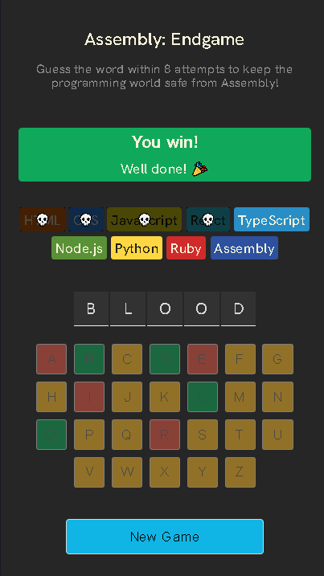

# Assembly Endgame

Assembly Endgame is a React-based web application that challenges users to guess a word within a limited number of attempts. The game features a farewell message for each incorrect guess and a confetti drop when the user wins.

## Table of Contents

- [Preview](#preview)
- [Getting Started](#getting-started)
- [Features](#features)
- [Project Structure](#project-structure)
- [Dependencies](#dependencies)
- [Usage](#usage)
- [Contributing](#contributing)
- [License](#license)

## Preview

Here is a preview of the Assembly Endgame application:


 

## Getting Started

To get started with Assembly Endgame, follow these steps:

1. Clone the repository:
    ```sh
    git clone https://github.com/yourusername/AssemblyEndgame
    cd AssemblyEndgame
    ```

2. Install the dependencies:
    ```sh
    npm install
    ```

3. Start the development server:
    ```sh
    npm start
    ```

The application will be available at `http://localhost:3000`.

## Features

- **Word Guessing Game**: Guess the word within a limited number of attempts.
- **Farewell Messages**: Display a farewell message for each incorrect guess.
- **Confetti Drop**: Celebrate with a confetti drop when the user wins.
- **Responsive Design**: The application is designed to be responsive and user-friendly.

## Project Structure

```
AssemblyEndgame/
├── App.jsx
├── hint.md
├── index.css
├── index.html
├── index.jsx
├── languages.js
├── package.json
├── README.md
├── utils.js
├── vite.config.js
├── words.js
```

- **App.jsx**: Main application component.
- **hint.md**: Contains hints for the game.
- **index.css**: Global CSS styles.
- **index.html**: HTML template.
- **index.jsx**: Entry point for the React application.
- **languages.js**: Contains the list of programming languages used in the game.
- **utils.js**: Utility functions for the game.
- **vite.config.js**: Vite configuration file.
- **words.js**: Contains the list of words used in the game.

## Dependencies

- **React**: A JavaScript library for building user interfaces.
- **React DOM**: Provides DOM-specific methods for React.
- **clsx**: A utility for constructing 

className

 strings conditionally.
- **react-confetti**: A React component for confetti animations.
- **Vite**: A build tool that provides a fast development server.

## Usage

1. **Start a New Game**: Click the "New Game" button to start a new game.
2. **Guess Letters**: Use the on-screen keyboard to guess letters.
3. **View Status**: The game status will update based on your guesses.
4. **Win or Lose**: The game will display a win or lose message based on your performance.

## Contributing

We welcome contributions to improve Assembly Endgame. To contribute, please follow these steps:

1. Fork the repository.
2. Create a new branch (`git checkout -b feature-branch`).
3. Make your changes and commit them (`git commit -m 'Add new feature'`).
4. Push to the branch (`git push origin feature-branch`).
5. Create a pull request.

## License

This project is licensed under the MIT License. See the LICENSE file for details.
